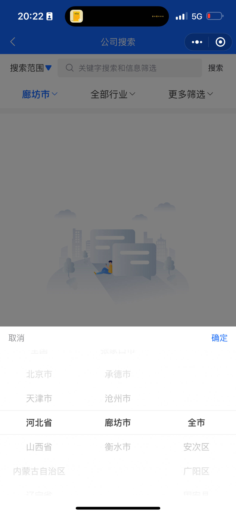
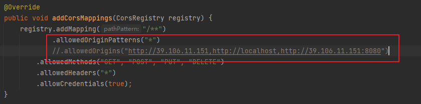
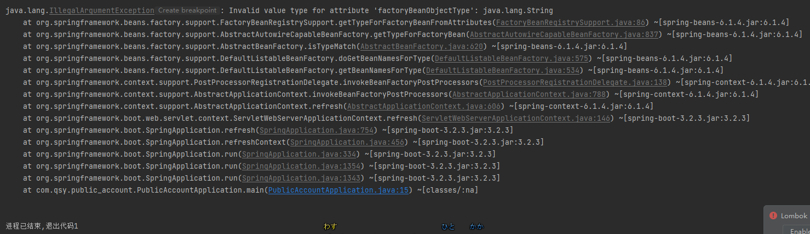
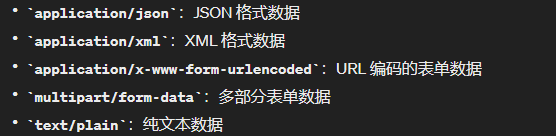
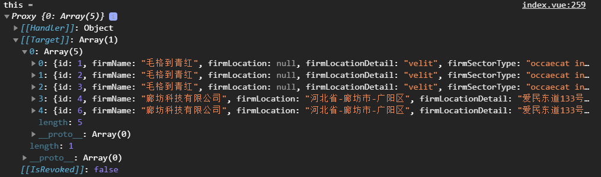

# TODO

1、✔给小程序加一个缓存，但是缓存什么时候删除要考虑号

2、✔查询页面 年份为3年及之前；

​		✔添加一个转让状态字段。若已转让则不在首页显示；

​		✔下拉刷新。

​		✔上拉加载。

3、✔添加一个 ==我的== 页面，可以查看、修改自己发布的信息。

❗4、添加一个 ==帮助或者注意事项== 

5、✔发布页面 分类，分为 ==求购和卖出== ；无需全部都填写，部分填写。需要判断是否已经填写；判断手机号位数是否正确；需要有一个保存页面；

6、✔详情页面 删去查询；电话可以添加一个直接拨打或者复制功能；

❌7、tabbar上拉菜单

8、✔单独创建一个表，首页表查询表，仅有id，公司名，所在地，成立时间，行业类型，纳税性质，转让状态字段。在上传时，先添加公司信息，再添加这个。

9、✔建一个求购表，字段如 id、所在地、成立时间、行业类型、纳税性质；

10、优化查询框、查询按钮要修改颜色



11、查询后的数据按时间排序

12、使用modify_time字段，前端在排序时使用该字段，后端在添加时设置，修改时修改该字段。


❌❌❌❌❌

✔未知bug；上传公司详情出错，上传时变为数组，导致后端接收失败

发布时记得修改



# 问题

## mybatis-plus结合springboot3，在注入mapper时遇到错误

现象：如图，查找原因后，是mybatis-plus的依赖不支持springboot3。具体查看 [Spring Boot 升级 3.2 报错) ](https://developer.aliyun.com/article/1395691) 

解决：修改mybatis-plus依赖为springboot3版本

```
<dependency>
    <groupId>com.baomidou</groupId>
    	<artifactId>mybatis-plus-spring-boot3-starter</artifactId>
    <version>3.5.5</version>
</dependency>
```




## 前端发起带数据的请求出现错误

现象：使用uni的request发起一个post请求时，后端应接收的page跟size接收为null。

原因：uni.request默认请求头的Content-Type是 ==application/json== 类型的。而后端需要 ==application/x-www-form-urlencoded== 才能识别

解决：设置请求头的Content-Type。

```js
uni.request({
    url:config.domain + 'firmInfoList',
     /*header: {  
     	'Content-Type': 'application/x-www-form-urlencoded'  
	},*/ 
    data:{
        page: 1,
        size: 2
    },
    method:'POST',
    success(res) {
    	console.log("data: ",res);
    }
})
```




## 前端接收数据类型错误

现象：前端接收的数据变成了Proxy，而不是json

解决：




